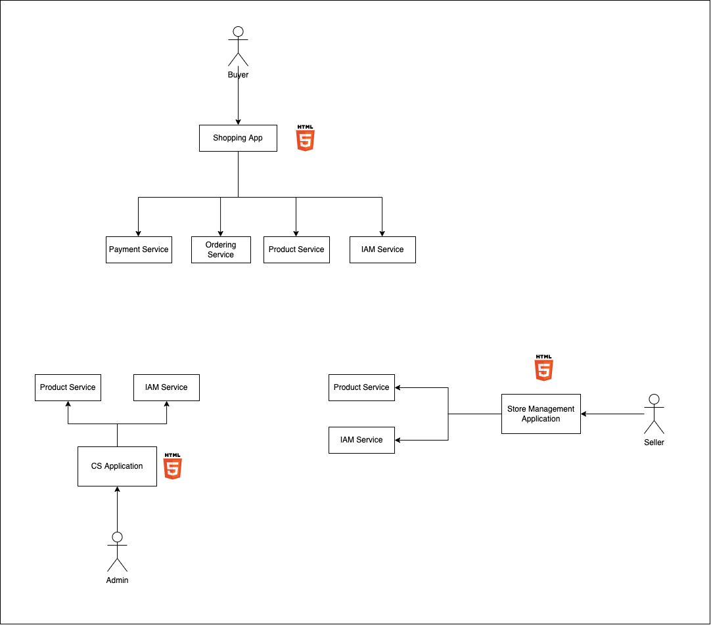

# System Architecture Test

## System design

## infrastructure

## Database structure

## Tech stack

### Frontend

It's depend on team, but I preferred VueJS and NuxtJS to keep it simple.

### Backend

For performance I will use **Go**, **Python (Fast API)**, **TypeScript** and avoid **PHP**

### Database

- PostgresSQL
- DynamoDB (Optional)

### Messaging

- RabbitMQ
- Kafka

## Team

- 1-2 Frontend Engineer
- 1-2 Backend Engineer
- 1 Devops Engineer
- 1 UI designer
- 1 Business Analysis
