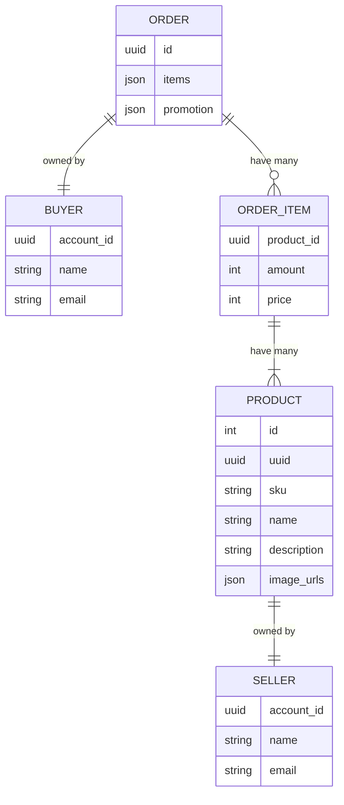
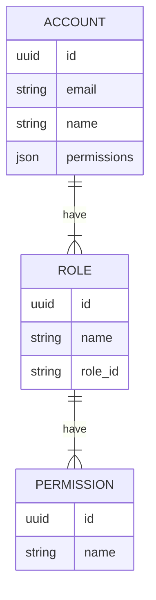
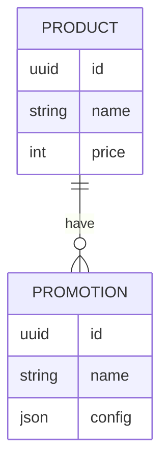
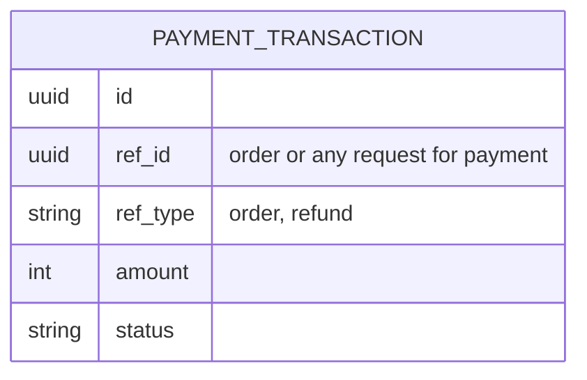

# Entity Relation

## Ordering

```mermaid
erDiagram
    PRODUCT {
        int id
        uuid uuid
        string sku
        string name
        string description
        json image_urls
    }

    SELLER {
        uuid account_id
        string name
        string email
    }

    BUYER {
        uuid account_id
        string name
        string email
    }

    ORDER {
        uuid id
        json items
        json promotion
    }

    ORDER_ITEM {
        uuid product_id
        int amount
        int price
    }

    ORDER ||--|| BUYER : "owned by"
    ORDER ||--o{ ORDER_ITEM : "have many"
    ORDER_ITEM ||--|{ PRODUCT : "have many"
    PRODUCT ||--|| SELLER : "owned by"
```

## IAM

```mermaid
erDiagram
    ACCOUNT {
        uuid id
        string email
        string name
        json permissions
    }

    ROLE {
        uuid id
        string name
        string role_id
    }

    PERMISSION {
        uuid id
        string name
    }

    ACCOUNT ||--|{ ROLE : have
    ROLE ||--|{ PERMISSION : have
```

## Product

```mermaid
erDiagram
    PRODUCT {
        uuid id
        string name
        int price
    }

    PROMOTION {
        uuid id
        string name
        json config
    }

    PRODUCT ||--o{ PROMOTION : have

```

## Payment

```mermaid
erDiagram
    PAYMENT_TRANSACTION {
        uuid id
        uuid ref_id  "order or any request for payment"
        string ref_type  "order, refund"
        int amount
        string status
    }
```
